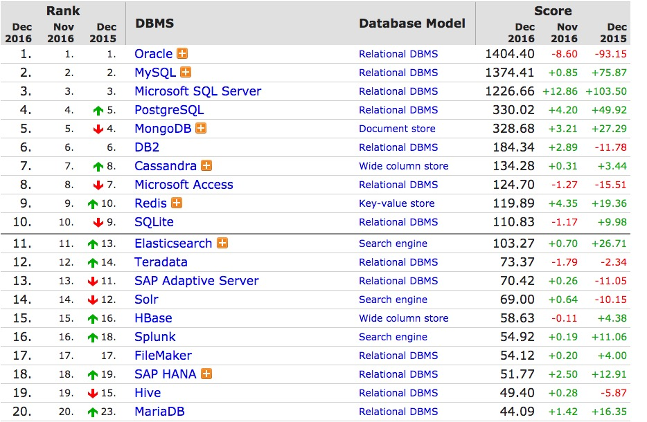

# MongoDB 项目中的应用

## 介绍

### 文档数据库
> MongoDB中的一条记录就是一个文档，是一个数据结构，由字段和值对组成。MongoDB文档与JSON对象类似。字段的值有可能包括其它文档、数组以及文档数组。实现语言： C++, 是一个基于分布式文件存储的开源数据库系统。

### 排名


### 关于文档
1. 健不能包含有 \0 (空字符)，这个字符用来表示键的结尾；
2. . 和 $ 有特别的意义，只有在特定环境下才能使用；
3. 以下划线 (_) 开头的键是保留的；
4. 文档的键是区分大小写的，并且同一个文档不能有重复的键；
5. MongoDB 不仅区分类型，也区分大小写。

```
# 以下文档是不同的
{"age": "14"}
{"age": 14}
```


### 使用 BSON(面向文档存储) 存储数据
1. BSON 不改变JSON 处理数据的方式
2. 最大可存储16M 的数据。
2. 使Mongo 处理速度变得更快
3. 添加了一些JSON 不支持的特性，包括二进制数据添加类型。
4. BSON相对JSON占用空间更多。以空间换取时间。
5. BSON 容易将数据转换为编程语言的原生数据格式。BSON可以存储JSON文档。

### 游标
> 在使用find()时，并不直接返回结果，而是返回一个结果集的迭代器。

```
var cursor = db.test.find();
if (cursor->hasNext()) {
	print(cursor->next())
}

# 查看游标的使用情况
db.serverStatus().metrics.cursor

# 返回结果
{
  "timedOut" : NumberLong(0), //数据库启动以来超时的游标个数
  "open" : {
      "noTimeout" : NumberLong(0), //使用noTimeout阻止超时的游标个数
      "pinned" : NumberLong(0), //打开的pinned类型的游标个数
      "total" : NumberLong(0) //打开的游标总数
  }
}
```
> **游标的生命周期**
> 
> - 游标在完成匹配结果的迭代时，它会清除自身。
> - 如果游标已经不在作用域内，驱动程序会向服务器发送一条特别消息，让其销毁游标。
> - 如果一个游标在10分钟内没有使用的话，数据库游标也会自行销毁。


## 与 Mysql 对比

1. 更高的写负载需求。对比 Mysql 的事务安全，Mongo 有更高的插入速度。如果我们需要加载大量的业务数据，比如日志，事务性较低的业务数据。对于事务性较高的，比如交易等，还是更适用Mysql。
2. 不可靠环境可以保证高可用。涉及到Mongo 副本集，可快速搭建且能实现自动化故障转移。
3. 基于位置的数据查询。MongoDB支持二维空间索引，因此可以快速及精确的从指定位置获取数据。如某地图网站上可以查找离你最近的咖啡厅,银行等信息
4. Mysql 在增加列的时候，有可能会锁定整个库，或增加负载而导致性能下降。而Mongo是弱数据结构模式，添加字段不会对旧的表格产生影响。
5. Mysql 在需要多次查询的情况下，Mongo有可能只需要一次查询就能搞定。

## 什么时候会用到？
1. 大规模写操作时
> Mongo 以胜任的一个特殊角色是在日志领域。

2. 无须定义固定的模式。
> 就是说，我们不需要定义固定的表结构，无须为了后续数据新增字段，而把以前的所有数据全部同步。

3. 数据处理
> 比如MapReduce/Aggregation Pipeline（聚合管道） 。
> 对那些尚未支持管道的，需要使用复杂方法的，不常见的聚合使用 MapReduce。


	**map-reduce参数说明**
	- map ：映射函数 (生成键值对序列,作为 reduce 函数参数)。
	- reduce 统计函数，reduce函数的任务就是将key-values变成key-value，也就是把values数组变成一个单一的值value。。
	- out 统计结果存放集合 (不指定则使用临时集合,在客户端断开后自动删除)。
	- query 一个筛选条件，只有满足条件的文档才会调用map函数。（query。limit，sort可以随意组合）
	- sort 和limit结合的sort排序参数（也是在发往map函数前给文档排序），可以优化分组机制
	- limit 发往map函数的文档数量的上限（要是没有limit，单独使用sort的用处不大）

4. 地理空间查询
>  允许你保存 geoJSON 或者 x 和 y 坐标到文档，并查询文档，用如 $near 来获取坐标集，或者 $within 来获取一个矩形或圆中的点。

5.

## 实际项目中的小技巧
1. 模糊查询
```
db.user.find({"name": /lee*/i});
```

2. upsert : 在更新时去检验是update还是insert
>
```
db.user.update(where, data, <upsert: false, multi: false, writeConcern>);
```

3. 自增id，使用findAndModify与runCommand实现
>
```
### PHP 版本 
function genId($db, $name){
	$command = array(
		'findAndModify' => 'ids',
		'query' => array('name' => $name),
		'update' => array('$inc' => array('id' => 1)),
		'upsert' => true,//若是第一次创建，upsert一定要写上，否则，不会出现自增id
		'new' => true
	);
	$data = $db->command($command);
	if (isset($data['ok']) && $data['value']['id']) {
		return $data['value']['id'];
	}
	return false;
}
```

4. MapReduce 多适用于数据分析与统计。
5. MongoDB的数据空间分配、使用方式导致在高写入、删除场景下会产生比较多的磁盘碎片，尽量关注磁盘碎片的体积并在适当的时候进行回收。
6. 存储过过程
> 
```
	db.system.js.save(_id: "addNumber", value: function(x, y) {return x+y;});
	db.eval('addNumber(10, 11)');
```

7. 避免使用skip略过大量的结果。
