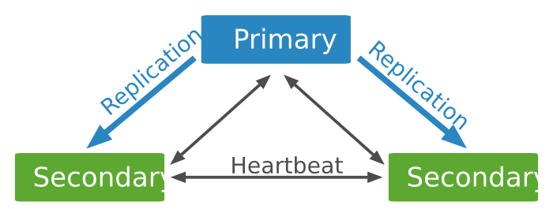

## 复制介绍
> 复制是在多台服务器之间同步数据的过程。复制集在大多数场合下已经代替Master-Slave复制。如果可能的话，尽可能使用复制集而不是主-从复制架构。

### 节点介绍
#### 主节点（Primary）
> 在复制集中，主节点是唯一能够接收写请求的节点。MongoDB在主节点进行写操作，并将这些操作记录到主节点的oplog中。而从节点将会从oplog复制到其本机，并将这些操作应用到自己的数据集上。（复制集最多只能拥有一个主节点）

#### 从节点（Secondaries）
> 从节点通过应用主节点传来的数据变动操作来保持其数据集与主节点一致。从节点也可以通过增加额外参数配置来对应特殊需求。例如，从节点可以是non-voting或是priority 0.

#### 仲裁节点（ARBITER）
> 仲裁节点即投票节点，其本身并不包含数据集，且也无法晋升为主节点。但是，旦当前的主节点不可用时，投票节点就会参与到新的主节点选举的投票中。仲裁节点使用最小的资源并且不要求硬件设备。投票节点的存在使得复制集可以以偶数个节点存在，而无需为复制集再新增节点 **不要将投票节点运行在复制集的主节点或从节点机器上**。 投票节点与其他 复制集节点的交流仅有：选举过程中的投票，心跳检测和配置数据。这些交互都是不加密的。

- Tip 1 : 一个复制集至少需要这个成员：一个主节点，一个从节点和一个投票节点。但是在大多数情况下，我们会保持3个拥有数据集的节点：一个主节点和两个从节点。即

- Tip 2 : mongo3.0.0 版本更改：一个复制集最多可添加到50个节点，但是只能有7个投票节点（包括主节点）。在此之前，复制集最多可添加12个节点。

## 节点规则

## 配置副本集
> 准备三台机器，并且必须保持三台服务器能够相互连接，配置为一主一从一仲裁的模式
> 
    1. 192.168.1.7：27017 
    2. 192.168.1.8：27017
    3. 192.168.1.9：27017
   
### 配置文件说明
<pre><code>
# 日志记录
logpath=/tmp/mongodb/log/mongod.log
logappend=true
# fork and run in background
fork = true
port = 27017
dbpath=/tmp/mongodb/data
# location of pidfile
pidfilepath = /tmp/mongodb/log/mongod.pid
rest = true
maxConns=32000

# Disables write-ahead journaling
# nojournal = true

# Replication Options
replSet=RsM
</code></pre>
### 服务启动
分别启动三台mongo服务
<pre>
/tmp/mongodb/bin/mongod -f /tmp/mongodb/conf/mongo.conf
</pre>
### 初始化配置
> 进入其中一台mongo，进行配置（注：帐户权限，认证忽略）
> 增加一个变量 
<pre><code>
cfg = {"_id": "RsM", "members":[
	{"_id": 0,"host":"192.168.1.7:27017","priority":1},
	{"_id": 1,"host":"192.168.1.8:27017","priority":1},
	{"_id": 2,"host":"192.168.1.9:27017","priority":1},
]};
rs.initate(cfg);

 # 查看状态
rs.status()

</code></pre>

## 测试故障自助转移
> 杀掉主节点，进入从节点后，利用rs.status();查看状态即可！

## 补充说明

### 新增节点与去除节点
<pre>
<code>
	rs.add("ip:port"); // 新增从节点
	rs.addArb("ip:port"); // 新增仲裁节点
	rs.remove("ip:port"); // 删除一个节点
	rs.isMaster(); // 查看当前是否是主节点
</code>
</pre>

