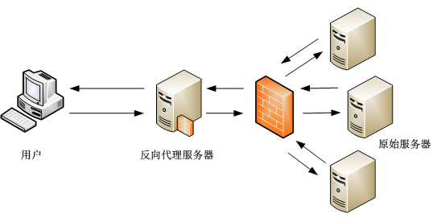

# Nginx 基础知识点整理

### Nginx的优势
* 更快
	* 正常情况下，单次请求响应更快
	* 高峰期，Nginx可以比其他Web服务器更快地响应请求
* 高扩展性
	* 由多个不同功能、不同层次、不同类型且耦合度极低的模块组成，可以专注模块自身
* 高可靠性
	* 源自Nginx的优秀设计，一个master管理多个worker，每个worker进程相对独立。
* 低内存消耗
	* 一般情况下，10000个非活跃的HTTP Keep-Alive 连接在Nginx中仅消耗2.5MB的内存
* 单机支持10万以上的并发连接
	* 非常重要的一个特性。理论上，Nginx支持的并发连接上限取决于内存。
* 热部署
	* Master管理进程与worker工作进程的分离设计，可以在不停止服务进行升级，更新配置，切换日志
* 最自由的BSD许可协议

### Nginx进程间的关系

- Nginx 支持单进程服务（即master进程提供服务）
	> Nginx 在配置文件里提供 `master_process on|off`来修改Nginx的运行方式，默认为`on`，为master-worker运行。关闭后，master 就不会fork出worker子进程来处理请求，而是直接使用master自身来处理请求，一般使用这种方式只是为了方便跟踪调试Nginx，并不用在实际生产环境中。

- Nginx 提供master-worker配置启动多进程服务

> Nginx运行在该模式下， Master进程并不会参与处理请求，只用来管理真正提供服务的worker进程，并提供启动服务、停止服务、重载配置文件、平滑升级等命令。一般来说，master拥有的权限要大于或等于worker权限，这样便于管理worker进程。另外，多个worker进程处理方式可以提高服务的健壮性。

### Nginx 应该了解的基本配置
1. 是否以守护进程的方式运行Nginx。设置`daemon on|off`，默认为`on`。毫无疑问，Nginx是需要以守护进程的方式来支持的，之所以提供这种模式，是为了方便开发者跟踪调试Nginx，这样大大方便了gdb调试跟进fork出的子进程的烦琐。
2. 是否以 master/worker方式运行。在上面已经提到过了
3. error 日志设置。 设置 `error_log /path/file level`。error日志是定位服务出现问题最直接的一个手段，也是必不可少的一个设置。它默认是`logs/error.log error`，level 是日志的输出级别，包括`debug`、`info`、`notice`、`warn`、`error`、`crit`、`alert`、`emerg`八个级别，从左至右依次增大。当设定一个级别的时候，大于或等于该级别的日志都会输出到文件中。**注意：**如果日志级别是debug的话，必须在configure 时加入--with-debug配置项。
4. 嵌入其他配置文件。使用`include /path/file`嵌入到当前的nginx.conf中，file参数的值可以是一个明确的文件名，也可以含有通配符*的文件名。
5. pid文件的路径。设置`pid /path/file`，默认是`pid logs/nginx.pid`，这是一个保存master进程ID的文件，默认是与configure编译时参数`--pid-path`所指定路径一致，可随时修改，但要确保Nginx有权在创建pid文件，它影响着Nginx是否可以运行。
6. Nginx worker 进程运行的用户及用户级。设置`user nobody nobody`，在执行configure 编译时，可使用`--user=nobody`和`--group=nobody`设置。该设置会在master进程启动时，用于运行fork出来的worker进程。
7. Nginx worker的进程个数。 设置`worker_processes number`，默认为`1`，我们都知道worker进程数量会直接影响性能。一般情况下，我们会worker进程数量会与CPU核心数设置一致。
8. lock 文件的设置。 设置`lock_file /paht/file`，默认`lock_file logs/nginx.lock`，这个可能跟accept锁有些千丝万缕的关系，我们就不在这里展开赘述了。
9. 事件模型的选择。模型包括`kqueue|rtsig|epoll|/dev/poll|select|poll|eventport`，nginx会自动选择比较合适的模型，Linux用户来说，一般会使用epoll，它的性能比较高。
10. 每个worker的最大连接数。用于定义每个worker进程可以同时处理的最大连接数。

### Nginx的worker进程数量为什么要与CPU核心数量一致呢？
Nginx的一个worker进程可以同时处理的请求数只受限于内存的大小，而在架构设计上，不同的worker进程之间处理并发请求时几乎没有同步锁的限制，worker进程通常不会进入休息睡眠状态，所以，当Nginx上的进程数与CPU核心数相等时，进程间切换的代价是最小的。每个worker进程都是单线程的进程，多worker进程可以充分利用多核系统架构，如果worker进程数多于CPU内核数，那么会增大进程间切换带来的消耗（Linux是抢占式内核）。Nginx为了更好的利用多核的特性，提供了cpu亲缘性的绑定选项，可以将某个进程绑定在某一个核上，这样就不会因为进程的切换带来cache的失效。

### 关于事件模型epoll的一些了解
> epoll库是Nginx服务器支持高性能事件驱动库，属于poll库的一个变种，是在Linux2.5.44引入。它与poll/select库最大的区别在于效率。

**poll和select的处理方式**

1. 创建一个待处理事件列表
2. 列表发送到内核
3. 返回时再轮询检查这个列表，判断事件是否发生。

**epoll 的处理方式**

1. epoll 库通过相关调用通知内核创建一个有N个描述符的事件列表
2. 给描述符设置所关注事件，并添加到内核事件列表
3. 通过相关能用对事件列表中的描述符进行修改与删除

这样，只需要在进程启动时建立一个epoll对象，并在需要的时候进行添加或者删除就可以了。

### 关于反向代理

**反向代理（Reverse Proxy）** 方式是指用代理服务器来接受Internet上的连接请求，然后将请求转发给内部网络上的服务器，并将从服务器上得到的结果返回给Internet上请求连接的客户端。
如下图

当客户端发来HTTP请求时，Nginx并不立刻转发到上游服务器，而是先把用户的请求完整地接收到Nginx所在的服务器的硬盘或者内存中，然后再向上游服务器发起连接，把缓存的客户端请求转发到上游服务器。这种方式的缺点是延长了一个请求的处理时间，并增加了用于缓存请求内容的内存和磁盘空间。而优点则不言而喻，大大降低了上游服务器的负载，尽量把压力放到Nginx的服务器上。

**反向代理的基本配置**

1. proxy_pass URL

	> 该配置项会将当前的请求反向代理到URL参数指定的服务器上，URL可以是主机名或者IP+port形式，也可以是UNIX句柄，亦或者是直接使用upstream块。
	
	```
	# 主机名+端口方式
	proxy_pass http://example.com:8080/path
	# UNIX句柄
	proxy_pass http://unix:/path/to/back.socket:/path/;
	# 负载均衡方式
	upstream backend {...}
	
	proxy_pass http://backend;
	```
	**注意** 反向代理默认情况下不会转发请求中的Host头部分，如果需要转发，则必须加上 proxy_set_header Host $host.

2. proxy_method method 

	> 该配置项表示转发时的协议方法名。如果设置为POST，则客户端发过的GET请求也会转发为POST请求。

3. proxy_hide_header Header

	> 该配置项会禁止某些HTTP头部字段不能被转发
	
4. proxy_pass_header Header

	> 与proxy_hide_header刚好相反，会将原来禁止转发的header设置为转发
	
5. proxy_pass_request_body on | off

	> 作用为确定是否向上游服务器发送HTTP包体部分

6. proxy_pass_request_headers on | off

	> 确定是否转发HTTP头部

7. proxy_redirect [default|off|redirect|replacement]

	> 当上游服务器返回的响应是重定向或刷新请求时，proxy_redirect 可以重设HTTP头部的location或refresh。
	

**反向代理实例**

```
upstream backendServer  {
    server 192.168.0.1:8080 weight=10; 
    server 192.168.0.2:8080 weight=10; 
    server 192.168.0.3:8080 weight=10; 
    ...
}

server {
    listen 80;
    server_name  www.quancha.cn;
 
    access_log  logs/quancha.access.log  main;
    error_log  logs/quancha.error.log;
    root   html;
    index  index.html index.htm index.php;
 
    ## send request to backendServer ##
    location / {
        proxy_pass  http://backendServer;
 
        #Proxy Settings
        proxy_redirect     off;
        proxy_set_header   Host             $host;
        proxy_set_header   X-Real-IP        $remote_addr;
        proxy_set_header   X-Forwarded-For  $proxy_add_x_forwarded_for;
        proxy_next_upstream error timeout invalid_header http_500 http_502 http_503 http_504;
        proxy_max_temp_file_size 0;
        proxy_connect_timeout      90;
        proxy_send_timeout         90;
        proxy_read_timeout         90;
        proxy_buffer_size          4k;
        proxy_buffers              4 32k;
        proxy_busy_buffers_size    64k;
        proxy_temp_file_write_size 64k;
   }
}

```
