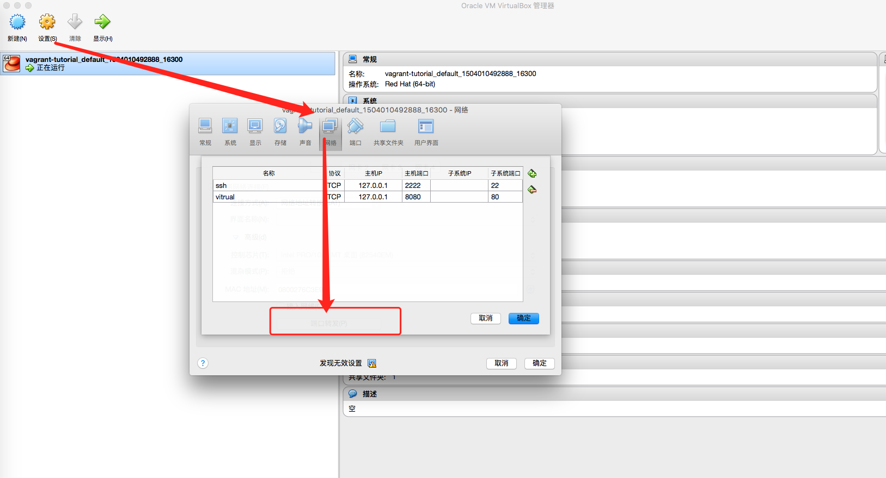

## 基础环境

- VirtualBox 下载地址 `https://www.virtualbox.org/wiki/Download_Old_Builds_5_1`
- vagrant 下载地址： `https://releases.hashicorp.com/vagrant/`

- CentOs 7.2 下载地址： ` https://github.com/CommanderK5/packer-centos-template/releases/download/0.7.2/vagrant-centos-7.2.box`


## 初始化 Vagrant 环境

1. 添加box操作： `vagrant box add CentOs72 /path/vagrant-centos-7.2.box`
2. 显示当前已经添加的box列表： `vagrant box list`
3. 创建一个vagrant 开发环境目录： `mkdir ~/dev` 并 `cd ~/dev`
4. 用CentOs72 进行box的初始化： `vagrant init CentOs72`，会在该目录下生成一个`Vagrantfile`文件
5. 启动环境： `vagrant up`
6. ssh登录： `vagrant ssh`
7. 关机： `vagrant halt`
8. 删除相应的box： `vagrant box remove boxname`
9. 停止当前正在运行的虚拟机并销毁所有创建的资源： `vagrant destroy`
10. 对当前虚拟机环境进行打包： `vagrant package`
11. 重启虚拟机，主要用于重新载入配置文件： `vagrant reload`
12. 输出用于ssh连接的信息： `vagrant ssh-config`
13. 获取当前虚拟机的状态： `vagrant status`


```
# Linux CentOs7.x 初始化系统
yum -y install gcc gcc-c++ autoconf libjpeg libjpeg-devel libpng libpng-devel freetype freetype-devel libxml2 libxml2-devel zlib zlib-devel glibc glibc-devel glib2 glib2-devel bzip2 bzip2-devel ncurses ncurses-devel curl curl-devel e2fsprogs e2fsprogs-devel krb5 krb5-devel libidn libidn-devel openssl openssl-devel openldap openldap-devel nss_ldap openldap-clients openldap-servers vim-common dos2unix readline readline-devel cmake bison libtool flex pkg-config patch gd gd-devel locate libevent libevent-devel openldap.x86_64 openldap-devel.x86_64 openldap-clients.x86_64 openssh-ldap.x86_64 libtiff-devel libtiff librsvg2-devel librsvg2 perl-ExtUtils-CBuilder perl-ExtUtils-MakeMaker lrzsz mailx libzip libzip-devel
```

#### 使用CentOs 7.2 不能使用`ifconfig`命令
1. `ifconfig`命令存在，则需要设置环境变量。`ifconfig`命令位置`/sbin/ifconfig`
2. `ifconfig`命令不存在，首先执行`yum upgrade`，再执行`yum install net-tools`

#### CentOs 7.2 默认没有vim
使用命令`sudo yum install -y vim`安装并使用vim

#### Vagrant 设置共享目录
> 在 Vagrantfile 里添加，如下

```
config.vm.synced_folder "/Users/xululu/Code/dev", "/home/vagrant", :nfs => true
```

在使用 nfs 格式时，需要在 Vagrantfile 里添加一个网络私有ip配置，公有网络是不可以使用 nfs 格式的。

Vagrant 提供了 `nfs` 和 `smb` 两种共享文件夹的形式。其中nfs只能用于非Windows系统。而 smb 只能用于windows系统。

## Vagrantfile配置文件详解
`Vagrantfile`主要包括三个方面的配置，虚拟机的配置、SSH配置、Vagrant的一些基础配置。


## 安装LNMP环境
### Nginx 
#### 安装Nginx
1. 查看yum源中是否有nginx 
	
	```
	[vagrant@bogon ~]$ yum info nginx
已加载插件：fastestmirror
Determining fastest mirrors
 * base: mirrors.yun-idc.com
 * epel: mirrors.tuna.tsinghua.edu.cn
 * extras: mirrors.nwsuaf.edu.cn
 * updates: mirrors.tuna.tsinghua.edu.cn
可安装的软件包
名称    ：nginx
架构    ：x86_64
时期       ：1
版本    ：1.10.2
发布    ：1.el7
大小    ：505 k
源    ：epel/x86_64
简介    ： A high performance web server and reverse proxy server
网址    ：http://nginx.org/
协议    ： BSD
描述    ： Nginx is a web server and a reverse proxy server for HTTP, SMTP, POP3 and
         : IMAP protocols, with a strong focus on high concurrency, performance and low
         : memory usage.
	```
2. 如果不存在，需要添加Nginx的下载源到yum：`sudo rpm -Uvh http://nginx.org/packages/centos/7/noarch/RPMS/nginx-release-centos-7-0.el7.ngx.noarch.rpm`，指定下载源后，可以直接使用yum命令安装
3. 安装Nginx： `sudo yum install -y nginx`
4. 安装完成后，使用curl测试：

	```
	[vagrant@bogon ~]$ curl -I "http://127.0.0.1"
	HTTP/1.1 200 OK
	Server: nginx/1.10.2
	Date: Wed, 30 Aug 2017 03:49:39 GMT
	Content-Type: text/html
	Content-Length: 3700
	Last-Modified: Mon, 31 Oct 2016 12:37:02 GMT
	Connection: keep-alive
	ETag: "58173aee-e74"
	Accept-Ranges: bytes
	```

#### Nginx安装目录解析
1. nginx执行文件目录： `/usr/sbin/nginx`
2. nginx配置文件目录： `/etc/nginx`
3. nginx扩展目录配置文件：`/usr/share/nginx/modules`
4. nginx默认项目目录：`/usr/share/nginx/html`
5. 启动nginx： `systemctl start nginx`
6. 关闭nginx： `systemctl stop nginx`
7. 重启nginx： `systemctl restart nginx`
8. 查看nginx状态： `systemctl status nginx`


#### Nginx 配置项目
> PHP 安装与配置继续往下看

```
server {
    listen 80;
    server_name www.example.com;
    root /home/vagrant/Code;

	access_log  /var/log/nginx/www.example.com-access.log  main;
	error_log  /var/log/nginx/www.example.com-error.log;

    location / {
            index index.php index.html index.htm;
            try_files $uri $uri/ /index.php$is_args$query_string;
    }
    # 防止/favicon.ico报日志错误
    location = /favicon.ico {
            log_not_found off;
            access_log off;
    }

    location ~ .*\.php$ {
            fastcgi_pass   127.0.0.1:9000;
            fastcgi_index  index.php;
            fastcgi_param  SCRIPT_FILENAME  $document_root$fastcgi_script_name;
            include fastcgi.conf;
    }

}
```

#### 如何在本机访问 Vagrant 配置的虚拟域名

##### 通过 VirtualBox 设置端口转发
在 `设置` => `网络` => `端口转发`



上图中， `端口转发` 按钮被弹出的小窗挡住。第二条 virtual 是新增的记录， 我们在本机通过访问 8080 端口转发到 Vagrant 中虚拟机的80端口。

然后，在 本机的 hosts 里添加， 

```
127.0.0.1 www.example.com
```

最后，在浏览器中访问, http://www.example.com 即可访问了。

**注意**  通过 VirtualBox 客户端设置的端口转发只能临时使用，如果 Vagrant 关闭后再重启，则端口转发的配置则会失效，需要重新新增转发记录。

##### 通过 Vagrantfile 文件配置端口转发，永久性配置
```
config.vm.network "forwarded_port", guest: 80, host: 8080, id: 'nginx'
```


### PHP
#### 下载 PHP7
```
http://php.net/distributions/php-7.1.8.tar.gz
```

#### 安装依赖包
```
yum install libxml2 libxml2-devel openssl openssl-devel bzip2 bzip2-devel libcurl libcurl-devel libjpeg libjpeg-devel libpng libpng-devel freetype freetype-devel gmp gmp-devel libmcrypt libmcrypt-devel readline readline-devel libxslt libxslt-devel
```

#### 编译PHP源码
```
cd php-7.1.8

// 附上一份PHP编译参数
./configure \
--prefix=/usr/local/php \
--with-config-file-path=/etc/php7 \
--enable-fpm \
--with-fpm-user=nginx  \
--with-fpm-group=nginx \
--enable-inline-optimization \
--disable-debug \
--disable-rpath \
--enable-shared  \
--enable-soap \
--with-libxml-dir \
--with-xmlrpc \
--with-openssl \
--with-mcrypt \
--with-mhash \
--with-pcre-regex \
--with-sqlite3 \
--with-zlib \
--enable-bcmath \
--with-iconv \
--with-bz2 \
--enable-calendar \
--with-curl \
--with-cdb \
--enable-dom \
--enable-exif \
--enable-fileinfo \
--enable-filter \
--with-pcre-dir \
--enable-ftp \
--with-gd \
--with-openssl-dir \
--with-jpeg-dir \
--with-png-dir \
--with-zlib-dir  \
--with-freetype-dir \
--enable-gd-native-ttf \
--enable-gd-jis-conv \
--with-gettext \
--with-gmp \
--with-mhash \
--enable-json \
--enable-mbstring \
--enable-mbregex \
--enable-mbregex-backtrack \
--with-libmbfl \
--with-onig \
--enable-pdo \
--with-mysqli=mysqlnd \
--with-pdo-mysql=mysqlnd \
--with-zlib-dir \
--with-pdo-sqlite \
--with-readline \
--enable-session \
--enable-shmop \
--enable-simplexml \
--enable-sockets  \
--enable-sysvmsg \
--enable-sysvsem \
--enable-sysvshm \
--enable-wddx \
--with-libxml-dir \
--with-xsl \
--enable-zip \
--enable-mysqlnd-compression-support \
--with-pear \
--enable-opcache
```

也可以按照官网提供方式进行编译： http://php.net/manual/zh/install.unix.nginx.php

我安装php的目录是`/usr/local/php`下， 这个目录可以自己定义，看自己喜好！而我选择把php.ini的配置文件放置在了 `/et/php7/`下，方便获取与使用。

#### 安装命令
```
make && make install
```

安装完成后的信息

```
Installing shared extensions:     /usr/local/php/lib/php/extensions/no-debug-non-zts-20160303/
Installing PHP CLI binary:        /usr/local/php/bin/
Installing PHP CLI man page:      /usr/local/php/php/man/man1/
Installing PHP FPM binary:        /usr/local/php/sbin/
Installing PHP FPM defconfig:     /usr/local/php/etc/
Installing PHP FPM man page:      /usr/local/php/php/man/man8/
Installing PHP FPM status page:   /usr/local/php/php/php/fpm/
Installing phpdbg binary:         /usr/local/php/bin/
Installing phpdbg man page:       /usr/local/php/php/man/man1/
Installing PHP CGI binary:        /usr/local/php/bin/
Installing PHP CGI man page:      /usr/local/php/php/man/man1/
Installing build environment:     /usr/local/php/lib/php/build/
Installing header files:          /usr/local/php/include/php/
Installing helper programs:       /usr/local/php/bin/
  program: phpize
  program: php-config
Installing man pages:             /usr/local/php/php/man/man1/
  page: phpize.1
  page: php-config.1
Installing PEAR environment:      /usr/local/php/lib/php/
[PEAR] Archive_Tar    - installed: 1.4.3
[PEAR] Console_Getopt - installed: 1.4.1
[PEAR] Structures_Graph- installed: 1.1.1
[PEAR] XML_Util       - installed: 1.4.2
[PEAR] PEAR           - installed: 1.10.5
Wrote PEAR system config file at: /usr/local/php/etc/pear.conf
You may want to add: /usr/local/php/lib/php to your php.ini include_path
/home/vagrant/php-7.1.8/build/shtool install -c ext/phar/phar.phar /usr/local/php/bin
ln -s -f phar.phar /usr/local/php/bin/phar
Installing PDO headers:           /usr/local/php/include/php/ext/pdo/
```

#### 配置PHP-FPM
```
sudo cp php.ini-production /etc/php7/php.ini
sudo cp /usr/local/php/etc/php-fpm.conf.default /usr/local/php/etc/php-fpm.conf
sudo cp /usr/local/php/etc/php-fpm.d/www.conf.default /usr/local/php/etc/php-fpm.d/www.conf
sudo cp sapi/fpm/init.d.php-fpm /etc/init.d/php-fpm
sudo chmod +x /etc/init.d/php-fpm
```

#### 启动PHP-FPM
```
sudo /etc/init.d/php-fpm start

// 查看PHP进程
[bogon@localhost php-7.1.8]$ ps aux | grep php
root     25450  0.0  0.7 237264  4460 ?        Ss   07:57   0:00 php-fpm: master process (/usr/local/php/etc/php-fpm.conf)
nginx    25451  0.0  0.6 237264  4012 ?        S    07:57   0:00 php-fpm: pool www
nginx    25452  0.0  0.6 237264  4012 ?        S    07:57   0:00 php-fpm: pool www
```

常用的启动、暂停、重启、重载命令：

1. sudo /etc/init.d/php-fpm start  
2. sudo /etc/init.d/php-fpm stop
3. sudo /etc/init.d/php-fpm reload
4. sudo /etc/init.d/php-fpm restart

#### PHP安装目录说明
1. PHP安装目录： `/usr/local/php`
2. PHP命令路径： `/usr/local/php/bin/php`
3. php.ini路径：`/etc/php7/php.ini`
4. php-fpm.conf路径： `/usr/local/php/etc/php-fpm.conf`


### Mysql 
> MariaDB是MySQL的一个分支，主要由开源社区进行维护和升级，而MySQL被Oracle收购以后，发展较慢。在CentOS 7的软件仓库中，将MySQL更替为了MariaDB

使用yum直接安装mariadb

```
sudo yum install -y mariadb-server
```

安装完成之后,重启MariaDB服务，如下命令

```
sudo systemctl start mariadb
```

Mysql 默认root密码为空，设置执行脚本为

```
sudo /usr/bin/mysql_secure_installation
```
这个脚本会经过一些列的交互问答来进行MariaDB的安全设置。

首先提示输入当前的root密码：

```
Enter current password for root (enter for none):
```
初始root密码为空，我们直接敲回车进行下一步。

```
Set root password? [Y/n]
```
设置root密码，默认选项为Yes，我们直接回车，提示输入密码，在这里设置您的MariaDB的root账户密码。

```
Remove anonymous users? [Y/n]
```
是否移除匿名用户，默认选项为Yes，建议按默认设置，回车继续。

```
Disallow root login remotely? [Y/n]
```
是否禁止root用户远程登录？如果您只在本机内访问MariaDB，建议按默认设置，回车继续。 如果您还有其他云主机需要使用root账号访问该数据库，则需要选择n。

```
Remove test database and access to it? [Y/n]
```
是否删除测试用的数据库和权限？ 建议按照默认设置，回车继续。

```
Reload privilege tables now? [Y/n]
```
是否重新加载权限表？因为我们上面更新了root的密码，这里需要重新加载，回车。

完成后你会看到Success!的提示，MariaDB的安全设置已经完成。我们可以使用以下命令登录MariaDB：

```
mysql -uroot -p
```
按提示输入root密码，就会进入MariaDB的交互界面，说明已经安装成功。

最后我们将MariaDB设置为开机启动。

```
sudo systemctl enable mariadb
```

**说明：** 以上Mysql的安装过程摘自美团云知识库，传送门：https://www.mtyun.com/library/18/how-to-install-lnmp-on-centos7/


